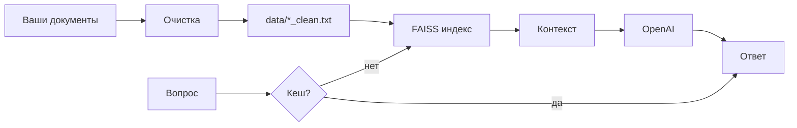

# rag-service-template

Продакшен‑шаблон RAG‑сервиса: подготовка документов → векторный поиск → ответы LLM (с кешем и оценкой качества).

Консольный ассистент, который отвечает на вопросы **по вашим материалам**, а не «из головы» модели. Технология называется **RAG** (Retrieval-Augmented Generation): сначала поиск по базе знаний, потом ответ с опорой на найденные фрагменты.

**Стек:** OpenAI API · FAISS (векторный поиск) · SQLite (кеш ответов) · RAGAS (оценка качества, опционально).

---

## Как это работает простыми словами

Вы собираете **базу знаний** — очищенные текстовые файлы в `assistant_api/data/`. При вопросе система:

1. Проверяет **кеш** — не спрашивали ли уже то же самое.
2. Ищет в **FAISS** самые похожие куски текста из ваших документов.
3. Отправляет эти куски в **OpenAI** как контекст и просит ответить по ним.
4. Сохраняет ответ в кеш и показывает вам результат.



---

## Пошаговый путь: что делать и в каком порядке

Ниже — полный цикл для человека, который **настраивает** проект. Не все шаги нужны каждый раз: установка — один раз, очистка — когда меняются материалы, чат — когда всё готово.

### Шаг 0. Установка (один раз)

| Действие | Команда / файл |
|----------|----------------|
| Клонировать / открыть проект | папка `rag-service-template` |
| Виртуальное окружение | `python -m venv .venv` → `.\.venv\Scripts\activate` |
| Зависимости | `pip install -r requirements.txt` |
| Браузер для скрапера | `playwright install chromium` |
| Секреты | скопировать `.env_exsample` → `.env`, вписать `OPENAI_API_KEY` |

Установка `pip` может занять **10–30 минут** — это нормально.

Ключ API: [platform.openai.com/api-keys](https://platform.openai.com/api-keys)

> Папка `assistant_api/data/` в репозиторий **не попадает** (только `.gitkeep`). После клонирования вы создаёте `data/` и файлы сами.

---

### Шаг 1. Подготовить исходные материалы

Всё, из чего будет база знаний, сначала попадает в проект **в сыром виде**:

| Источник | Куда класть / что указать |
|----------|---------------------------|
| Файлы Word, PDF, TXT | `assistant_api/data/raw/` или любой путь — потом укажете в команде |
| Страница сайта | URL в `.env`: `SCRAPER_PAGE_URL`, при необходимости `SCRAPER_PAGE_URL_2` |

Пример структуры:

```text
assistant_api/
  data/
    raw/              ← сюда about.docx, price_list.pdf, notes.txt
    .gitkeep
```

---

### Шаг 2. Очистить и привести к единому формату

Цель шага: получить файлы **`data/<имя>_clean.txt`** — чистый текст без лишней разметки, в одном стиле. Именно их читает ассистент.

#### Локальные файлы → `cleaner.py`

| Формат | Поддержка |
|--------|-----------|
| `.txt` | да |
| `.docx` | да (`python-docx`) |
| `.pdf` | да (`pypdf`) |

**Запуск из `assistant_api`:**

```powershell
cd assistant_api

# один файл (путь относительно assistant_api)
python cleaner.py about.docx
python cleaner.py data/raw/price_list.pdf

# все файлы в data/raw/
python cleaner.py
```

**Результат:** `data/about_clean.txt`, `data/price_list_clean.txt` и т.д.

Приоритет входа: **аргумент в терминале** → `CLEANER_INPUT_PATH` в `.env` → папка `data/raw/`.

#### Сайт по URL → `render_and_clean.py`

Скачивает страницу в headless-браузере (Playwright), убирает меню, футер, скрипты, сохраняет текст.

**В `.env` (корень проекта):**

```env
SCRAPER_PAGE_URL=https://example.com/
SCRAPER_PAGE_URL_2=          # необязательно
```

**Запуск:**

```powershell
cd assistant_api
python render_and_clean.py
```

**Результат:** `data/<домен>_clean.txt` (например `url_clean.txt`) и HTML-копия в `data/scraped/`.

---

### Шаг 3. Построить векторный индекс (FAISS)

Индекс **не создаётся** на шаге 2. Он строится при первом запуске ассистента (или вручную через `vector_store.py`).

Что происходит внутри `vector_store.py`:

- каждый `*_clean.txt` режется на **чанки** (~500 символов);
- для чанков считаются **эмбеддинги** через OpenAI (батчами);
- векторы сохраняются в `assistant_api/faiss_db/`;
- у каждого чанка есть **источник** (имя файла).

Проверка поиска без чата:

```powershell
python vector_store.py
```

Тестовый вопрос по умолчанию нейтральный; свой — в `.env`:

```env
VECTOR_STORE_TEST_QUERY=Какая информация содержится в базе знаний?
```

---

### Шаг 4. Главный режим — чат (`app.py`)

**Это основная точка входа для пользователя.** Здесь вы задаёте вопросы и получаете ответы.

```powershell
cd assistant_api
python app.py
```

При **первом** запуске `app.py` сам:

- загрузит все `data/*_clean.txt` в FAISS (если индекс пустой);
- создаст `api_rag_cache.db` для кеша ответов.

**Команды в чате:**

| Ввод | Действие |
|------|----------|
| любой текст | вопрос ассистенту |
| `stats` | число чанков, источники, размер кеша |
| `clear` | очистить кеш ответов |
| `exit` / `quit` | выход |

`app.py` не чистит документы и не ходит на сайты — он только **общается**, используя уже подготовленную базу.

#### Что такое `rag_pipeline.py` и зачем он нужен

`rag_pipeline.py` — это “движок” RAG. Именно он делает основную работу: **кеш → поиск по FAISS → сборка промпта → запрос к OpenAI → сохранение в кеш**.  
`app.py` — это только консольный интерфейс (ввод/вывод), он вызывает `pipeline.query()`.

#### (Опционально) Проверка кеша отдельно — `cache.py`

`cache.py` — это **отдельный тестовый модуль** для SQLite-кеша. Он нужен, если вы хотите быстро убедиться, что кеш создаётся/читается/очищается **без запуска всего RAG**.

Запуск:

```powershell
cd assistant_api
python cache.py
```

---

### Шаг 5. Обновили документы — что сбросить

После новых `*_clean.txt` старый индекс и кеш устаревают.

```powershell
cd assistant_api
Remove-Item -Recurse -Force .\faiss_db -ErrorAction SilentlyContinue
Remove-Item -Force .\api_rag_cache.db -ErrorAction SilentlyContinue
python app.py
```

В чате можно только `clear` — это сбросит кеш, но **не** переиндексирует FAISS.

---

### Шаг 6. Оценка качества (опционально) — `evaluate_ragas.py`

Отдельный «экзамен» для системы: несколько тестовых вопросов, метрики **Faithfulness**, **Context Precision** и (при рабочем доступе к OpenAI) **Answer Relevancy**. Кеш отключён, чтобы оценивать реальный RAG.

```powershell
python evaluate_ragas.py
```

Список вопросов задаётся в `EVALUATION_QUESTIONS` внутри файла — подстройте под свою тему.

Запускайте **после** того, как `app.py` уже нормально отвечает. Займёт около 1–2 минут и дополнительные запросы к OpenAI.

---

## Сводная таблица: какой файл за что

| Файл | Этап | Назначение |
|------|------|------------|
| **`cleaner.py`** | 2 | Очистка **локальных** `.txt`, `.docx`, `.pdf` → `data/*_clean.txt` |
| **`render_and_clean.py`** | 2 | Загрузка и очистка **страниц по URL** → `data/*_clean.txt` |
| **`vector_store.py`** | 3 | FAISS: чанки, эмбеддинги, поиск, метаданные источника |
| **`rag_pipeline.py`** | 4 (движок) | Связка: кеш → поиск → промпт → OpenAI → кеш |
| **`cache.py`** | 4 | SQLite-кеш готовых ответов |
| **`app.py`** | 4 | **Главный запуск** — интерактивный чат |
| **`evaluate_ragas.py`** | 6 | Метрики качества RAGAS (Faithfulness, Context Precision, Answer Relevancy) |
| **`data_paths.py`** | служебный | Правила имён для `*_clean.txt` и загрузка документов из `data/` |

**Не обязательно запускать** `rag_pipeline.py`, `cache.py`, `vector_store.py` перед `app.py` — они для отладки или оценки. Обычный сценарий: шаги 2 → 4.

---

## Что происходит при одном вопросе в `app.py`

```text
Вопрос
  → есть в кеше? → да → ответ из SQLite
  → нет → поиск в FAISS (top-3 чанка + источник файла)
  → промпт с контекстом → OpenAI gpt-4o-mini
  → ответ → сохранение в кеш → вывод в терминал
```

Модуль `rag_pipeline.py` содержит эту логику; `app.py` только показывает интерфейс и вызывает `pipeline.query()`.

---

## Что такое `data_paths.py`

`data_paths.py` — служебный файл, который отвечает за единый формат базы знаний:

- как формируются имена `data/<имя>_clean.txt`;
- как собрать список документов из `assistant_api/data/` (чтобы индексировать их по отдельности и сохранять `source`).

---

## Структура проекта

```text
5-8-final/
├── README.md
├── requirements.txt
├── .env_exsample          ← шаблон настроек
├── .env                   ← ваши секреты (не в git)
├── .gitignore
└── assistant_api/
    ├── app.py             ← главный запуск
    ├── cleaner.py         ← docx / pdf / txt
    ├── render_and_clean.py← URL → текст
    ├── vector_store.py    ← FAISS
    ├── rag_pipeline.py
    ├── cache.py
    ├── evaluate_ragas.py
    ├── data_paths.py
    ├── data/              ← в git только .gitkeep; файлы у вас локально
    │   ├── raw/
    │   ├── *_clean.txt    ← база для RAG
    │   └── scraped/       ← HTML со скрапера
    ├── faiss_db/          ← индекс (создаётся автоматически)
    └── api_rag_cache.db   ← кеш ответов
```

---

## Настройки в `.env` (кратко)

| Переменная | Для чего |
|------------|----------|
| `OPENAI_API_KEY` | эмбеддинги, ответы, RAGAS — **обязательно** |
| `SCRAPER_PAGE_URL` | URL для `render_and_clean.py` |
| `SCRAPER_PAGE_URL_2` | вторая страница (необязательно) |
| `PLAYWRIGHT_*` | таймауты и headless-режим браузера |
| `CLEANER_INPUT_PATH` | вход для `cleaner.py`, если не передаёте файл в командной строке |
| `VECTOR_STORE_TEST_QUERY` | тестовый вопрос для `vector_store.py` |

Подробные комментарии — в `.env_exsample`.

---

## Типичные проблемы

| Симптом | Решение |
|---------|---------|
| Playwright: `Executable doesn't exist` | `playwright install chromium` |
| `about.docx` — «не файл» | положите файл в `assistant_api` или укажите полный путь |
| Пустые / странные ответы | есть ли `data/*_clean.txt`? удалите `faiss_db`, перезапустите `app.py` |
| Ответы не обновились после смены текстов | удалите `faiss_db` и `api_rag_cache.db` |
| `No module named 'faiss'` | `pip install faiss-cpu` |
| Долгий первый запуск | индексация = много запросов эмбеддингов к OpenAI |

---

## Технические параметры

| Параметр | Значение |
|----------|----------|
| Эмбеддинги | OpenAI `text-embedding-3-small` |
| Векторная БД | FAISS, косинусное сходство |
| Чанки | ~500 символов, overlap ~100 |
| LLM | `gpt-4o-mini` (меняется в `app.py` / `evaluate_ragas.py`) |
| Кеш | SQLite `api_rag_cache.db` |

---

## Полезные ссылки

- [FAISS](https://github.com/facebookresearch/faiss/wiki)
- [OpenAI API](https://platform.openai.com/docs)
- [RAGAS](https://docs.ragas.io/)
- [RAG (статья)](https://arxiv.org/abs/2005.11401)

---

**Кратко:** подготовьте знания (шаг 2) → запустите `app.py` (шаг 4) → при смене материалов сбросьте индекс (шаг 5). Всё остальное — вспомогательные инструменты вокруг этого цикла.
