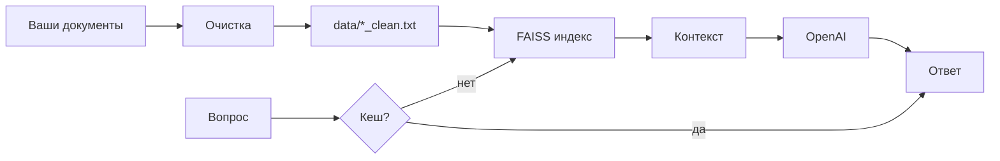

# 🤖 Шаблон RAG-ассистента (rag-service-template)

**Простыми словами:** вы складываете свои документы (Word, PDF, страницы сайта) — программа превращает их в **умного помощника**, который отвечает на вопросы **по вашим материалам**, а не «из головы» нейросети.

**rag-service-template** — готовый каркас умного помощника по вашим документам. Сотрудник или клиент получает ответ за секунды вместо поиска по файлам и ожидания поддержки. Повторные вопросы не тратят лишние деньги на API. Ответы опираются на ваши материалы с указанием источника. Решение можно развить до корпоративного ассистента с ролями и защитой данных — без разработки всего с нуля.

Это готовый **продакшен-шаблон**: подготовка документов → умный поиск → ответы ИИ → кеш и проверка качества.

Репозиторий **[rag-service-template](https://github.com/ms7-maker/rag-service-template)** — техническая основа.  
Задумка корпоративного ассистента с ролями и защитой — в проекте **[Rag Base assist / security-RAG-plan](https://ms7-maker.github.io/security-RAG-plan/)**.

> 💡 **RAG** (Retrieval-Augmented Generation) — сначала поиск по вашей базе знаний, потом ответ с опорой на найденные фрагменты.

---

## 💡 Удобство и выгода

- ⚡ **Быстрый старт** — не нужно писать RAG с нуля: шаблон уже собирает цепочку «документы → поиск → ответ». Запуск ассистента — **минуты**, а не недели разработки с подрядчиком.
- 💰 **Экономия на запросах** — повторные вопросы берутся из **кеша** (SQLite), без повторной оплаты нейросети. Один ответ вместо десятков однотипных обращений в поддержку.
- 📚 **Ответы из ваших файлов** — ассистент опирается на `*_clean.txt`, а не выдумывает. К каждому ответу видно **источник** (из какого документа взята информация).
- 🧠 **Нейросеть дорабатывает контекст** — вы задаёте вопрос обычными словами; система сама находит нужные куски текста и собирает промпт для OpenAI.
- 📋 **Готовая база под продукт** — шаблон стыкуется с идеей **Rag Base assist**: сюда ложатся FAQ, инструкции, прайсы; поверх можно добавить роли и защиту по [карте доступа](https://ms7-maker.github.io/security-RAG-plan/).
- 📊 **Контроль качества** — встроенная оценка RAGAS (насколько ответ правдив и релевантен контексту), без отдельного заказа аудита.

---

## ✨ Сильные стороны продукта

| Возможность | Зачем это вам |
|-------------|---------------|
| 📄 **Очистка документов** | Word, PDF, TXT → единый чистый текст |
| 🌐 **Загрузка с сайта** | URL → текст без меню и рекламы (Playwright) |
| 🔍 **Умный поиск FAISS** | Находит ответ по смыслу, не только по словам |
| 💬 **Чат в терминале** | Сразу спрашиваете и получаете ответ |
| 🗄️ **Кеш ответов** | Быстрее и дешевле при повторных вопросах |
| 📈 **Метрики RAGAS** | Проверка качества до выкладки в прод |
| 🔗 **Связка с security-RAG-plan** | План ролей, MFA и маскирования PII для корпоративного внедрения |

**Стек:** OpenAI API · FAISS · SQLite · RAGAS (опционально)

---

## 🧠 Как это работает (без сложных терминов)

1. **Вы кладёте материалы** — файлы или ссылки на страницы сайта.
2. **Программа чистит текст** — убирает лишнее, сохраняет в `data/*_clean.txt`.
3. **Строится индекс** — документы режутся на куски, для каждого считается «отпечаток смысла» (эмбеддинг).
4. **Вы задаёте вопрос** — система ищет похожие куски, отправляет их в OpenAI и возвращает ответ.
5. **Ответ сохраняется в кеш** — тот же вопрос в следующий раз не тратит деньги на API.



⏱️ Первый запуск с индексацией может занять **несколько минут** — идут запросы к OpenAI за эмбеддингами. Обычный вопрос в чате — **секунды**.

---

## 📋 Что нужно заранее

| Что | Зачем |
|-----|--------|
| 💻 **Python 3.11+** | Движок программы — [python.org](https://www.python.org/downloads/) |
| 🔑 **Ключ OpenAI** | Эмбеддинги и ответы — [platform.openai.com](https://platform.openai.com/api-keys) |
| 📁 **Ваши документы** | Word, PDF, TXT или URL страницы |
| 🌐 **Интернет** | Для API и (при необходимости) загрузки сайтов |

> 💡 Ключ — секретная строка. Не выкладывайте `.env` на GitHub и в чаты.

---

## 🚀 Как запустить (пошагово)

### Шаг 0. Установка (один раз)

```powershell
cd rag-service-template
python -m venv .venv
.\.venv\Scripts\activate
pip install -r requirements.txt
playwright install chromium
```

Скопируйте `.env_exsample` → `.env` и вставьте ключ:

```env
OPENAI_API_KEY=sk-ваш_ключ
```

Установка `pip` может занять **10–30 минут** — это нормально.

---

### Шаг 1. Подготовить материалы

| Источник | Куда |
|----------|------|
| Word, PDF, TXT | `assistant_api/data/raw/` |
| Страница сайта | URL в `.env`: `SCRAPER_PAGE_URL` |

> Папка `assistant_api/data/` в git пустая (только `.gitkeep`) — файлы создаёте вы локально.

---

### Шаг 2. Очистить документы → `*_clean.txt`

**Локальные файлы:**

```powershell
cd assistant_api
python cleaner.py data/raw/about.docx
python cleaner.py
```

**Сайт по URL** (в `.env` указать `SCRAPER_PAGE_URL`):

```powershell
python render_and_clean.py
```

**Результат:** файлы `data/about_clean.txt`, `data/url_clean.txt` и т.д.

---

### Шаг 3. Запустить чат (главный режим)

```powershell
python app.py
```

При **первом** запуске программа сама построит индекс FAISS из всех `*_clean.txt`.

**Команды в чате:**

| Ввод | Действие |
|------|----------|
| любой текст | вопрос ассистенту |
| `stats` | сколько чанков, источники, размер кеша |
| `clear` | очистить кеш ответов |
| `exit` / `quit` | выход |

Откройте в браузере не нужно — это **консольный** ассистент в терминале.

---

### Шаг 4. Обновили документы?

Удалите старый индекс и кеш, затем снова `python app.py`:

```powershell
Remove-Item -Recurse -Force .\faiss_db -ErrorAction SilentlyContinue
Remove-Item -Force .\api_rag_cache.db -ErrorAction SilentlyContinue
python app.py
```

---

### Шаг 5. Проверка качества (опционально)

```powershell
python evaluate_ragas.py
```

Несколько тестовых вопросов, метрики **Faithfulness** и **Context Precision**. Запускайте после того, как чат уже нормально отвечает (~1–2 мин, доп. запросы к OpenAI).

---

## 📂 Какой файл за что

| Файл | Простыми словами |
|------|------------------|
| **`cleaner.py`** | Чистит Word / PDF / TXT |
| **`render_and_clean.py`** | Скачивает и чистит страницу по URL |
| **`vector_store.py`** | Строит и проверяет поиск FAISS |
| **`rag_pipeline.py`** | «Движок»: кеш → поиск → OpenAI → кеш |
| **`app.py`** | **Главный запуск** — чат с ассистентом |
| **`cache.py`** | Тест кеша отдельно (для отладки) |
| **`evaluate_ragas.py`** | Оценка качества ответов |
| **`prompts.py`** | Шаблонные промпты (боевые — в приватном репо) |
| **`routing.py`** | Заглушка маршрутизации (полная версия — приватно) |
| **`fallback.py`** | Заглушка fallback (полная версия — приватно) |
| **`data_paths.py`** | Правила имён файлов `*_clean.txt` |

Обычный сценарий: **шаг 2 → шаг 3**. Остальное — для настройки и проверки.

---

## 📁 Структура проекта

```text
rag-service-template/
├── LICENSE
├── README.md
├── docs/
│   └── PUBLIC_AND_PRIVATE.md   ← что публично, что приватно
├── requirements.txt
├── .env_exsample
├── .env                  ← ваши секреты (не в git)
└── assistant_api/
    ├── app.py            ← главный запуск
    ├── cleaner.py
    ├── render_and_clean.py
    ├── vector_store.py
    ├── rag_pipeline.py
    ├── prompts.py
    ├── routing.py
    ├── fallback.py
    ├── cache.py
    ├── evaluate_ragas.py
    ├── data_paths.py
    ├── data/             ← ваши документы локально
    │   ├── raw/
    │   └── *_clean.txt
    ├── faiss_db/         ← индекс (создаётся автоматически)
    └── api_rag_cache.db  ← кеш ответов
```

---

## 💡 Экономический эффект (в связке с Rag Base assist)

Этот шаблон — **техническая часть** экосистемы умного ассистента для компании:

| Эффект | Как даёт rag-service-template |
|--------|-------------------------------|
| ⏱️ Меньше времени на поиск | Вопрос в чате вместо обхода папок с FAQ и инструкциями |
| 💰 Меньше трат на API | Кеш не платит дважды за один и тот же вопрос |
| 💰 Меньше трат на разработку | Готовый шаблон vs заказ RAG «с нуля» у подрядчика |
| 🛡️ Меньше рисков | Ответ с указанием источника; план ролей и PII — в [security-RAG-plan](https://ms7-maker.github.io/security-RAG-plan/) |
| 📞 Меньше нагрузки на поддержку | Повторяющиеся вопросы закрывает ассистент по вашим документам |

> **Rag Base assist** (план) + **rag-service-template** (код) = идея «кто что видит» + рабочий поиск по документам.

---

## ❓ Частые вопросы

**Пустые или странные ответы**  
→ Есть ли файлы `data/*_clean.txt`? Удалите `faiss_db`, перезапустите `app.py`.

**Ответы не обновились после смены текстов**  
→ Удалите `faiss_db` и `api_rag_cache.db`.

**Playwright: `Executable doesn't exist`**  
→ `playwright install chromium`

**Долгий первый запуск**  
→ Идёт индексация — много запросов эмбеддингов к OpenAI. Это нормально.

**Это бесплатно для личного изучения?**  
→ Репозиторий открыт для ознакомления. Лицензия — проприетарная: копирование, распространение и коммерция только с разрешения автора. **OpenAI берёт деньги** за эмбеддинги и ответы; кеш снижает расходы.

**Нужен ли интернет?**  
→ Да, для OpenAI API. Документы хранятся локально у вас.

---

## 🔒 Безопасность и лицензия

- 🔐 Файл **`.env`** с ключами не отправляйте в git, чаты и на скриншоты.
- 📁 База знаний лежит **на вашем компьютере** — вы сами решаете, какие документы подключать.
- 🛡️ Для корпоративного внедрения (роли, MFA, маскирование PII) смотрите [карту доступа Rag Base assist](https://ms7-maker.github.io/security-RAG-plan/).
- 📄 **Лицензия:** проприетарная, все права защищены — см. [LICENSE](LICENSE). Копирование, распространение и коммерческое использование без письменного разрешения автора запрещены.
- 🔀 **Публичный vs приватный код:** в этом репозитории — упрощённый шаблон; маршрутизация, fallback и боевые промпты — в приватном ядре. Подробнее: [docs/PUBLIC_AND_PRIVATE.md](docs/PUBLIC_AND_PRIVATE.md).

---

## ⚙️ Технические параметры

| Параметр | Значение |
|----------|----------|
| Эмбеддинги | OpenAI `text-embedding-3-small` |
| Поиск | FAISS, косинусное сходство |
| Чанки | ~500 символов, overlap ~100 |
| Модель ответов | `gpt-4o-mini` |
| Кеш | SQLite `api_rag_cache.db` |

---

## 💬 Кратко

| Действие | Команда |
|----------|---------|
| Очистить документы | `python cleaner.py` |
| Загрузить с сайта | `python render_and_clean.py` |
| **Запустить ассистента** | `python app.py` |
| Сбросить после обновления docs | удалить `faiss_db` + `api_rag_cache.db` |
| Проверить качество | `python evaluate_ragas.py` |

Удачи с вашим ассистентом по документам! 🚀
